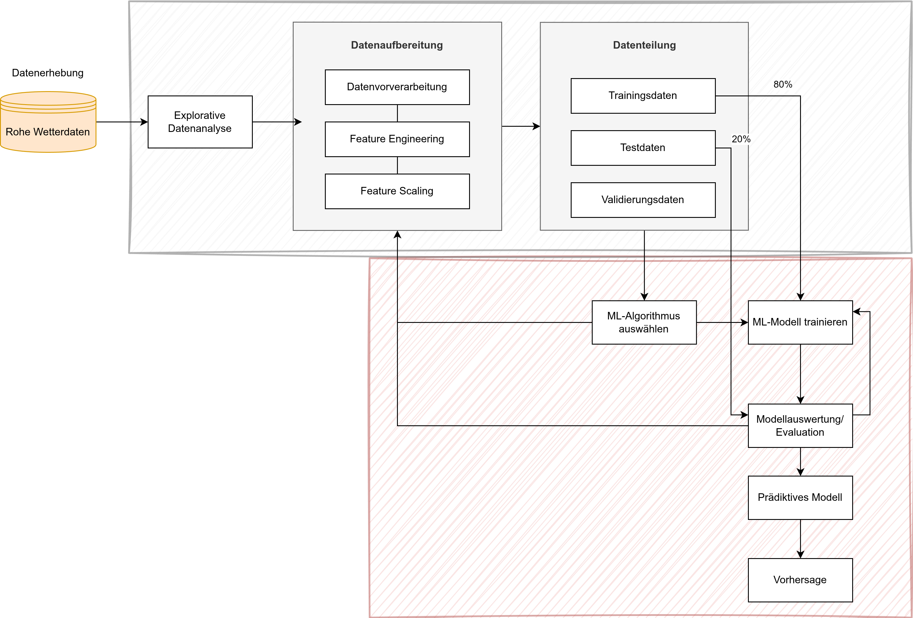

# METEOFLOW

<p align="center">
  
</p>

MeteoFlow is a machine learning-based weather forecasting CLI application that predicts average temperature and wind speed for Berlin.


## Key Features / Workflow

This project implements an end-to-end ML pipeline:

1. Automated Data Collection
2. Spatial Intepolation (IDW)
3. Exploratory Data Analysis with visualizations
4. Data Preprocessing
5. Feature Engineering with time-based features and lag variables
6. Model training: RandomForest and XGBoost
7. Evaluation: assesses model performance using standard regression metrics (MAE, RMSE, R²)
8. Prediction

<p align="center">
  
</p>


## Tools & Technologies

-   **Python**
-   **Pandas** for data manipulation
-   **Scikit-learn** for machine learning models and metrics
-   **XGBoost** for the gradient boosting model
-   **Matplotlib / Seaborn** for data visualization
-   **Click / Argparse** for the CL

## Installation

1.  Clone the repository:
    ```bash
    git clone https://github.com/achudnova/meteoflow.git
    cd meteoflow
    ```

2.  Install the required packages:
    ```bash
    pip install -r requirements.txt
    ```

## Usage (train the models)

To run the full pipeline, execute:

```bash
python3 src/main.py 
```

## To-Do

-   [ ] Translate the CLI from German to English.
-   [ ] Add more weather features (humidity, pressure, ...).